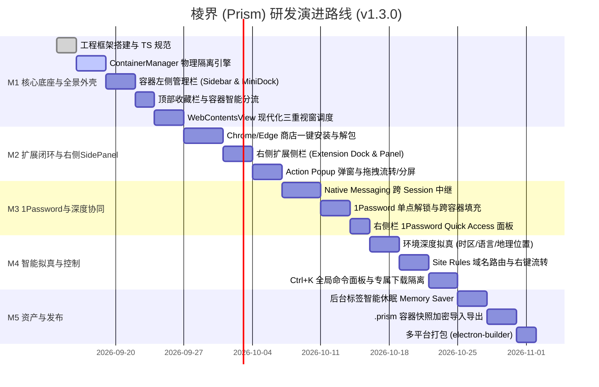

# 棱界 (Prism) — 核心功能需求与系统设计规范 (PRD & Functional Spec)

> **版本**：v1.3.0 (全景环绕工作台版：左侧容器 + 顶部收藏 + 右侧插件)  
> **状态**：Official Spec / 已审定  
> **代号**：Prism (棱界)  
> **核心标语**：一束光，多重身份。一个浏览器，多个并行的“我”。

---

## 目录
1. [产品愿景与系统全景](#1-产品愿景与系统全景)
2. [全景环绕工作台布局与视窗调度体系](#2-全景环绕工作台布局与视窗调度体系)
3. [多容器物理隔离与深度环境拟真体系](#3-多容器物理隔离与深度环境拟真体系)
4. [以容器为核心的左侧页面管理栏](#4-以容器为核心的左侧页面管理栏)
5. [容器感知型顶部收藏夹系统](#5-容器感知型顶部收藏夹系统)
6. [右侧扩展侧栏与 SidePanel 视窗体系](#6-右侧扩展侧栏与-sidepanel-视窗体系)
7. [官方扩展商店一键安装与插件作用域系统](#7-官方扩展商店一键安装与插件作用域系统)
8. [1Password 跨容器密码协同中继架构](#8-1password-跨容器密码协同中继架构)
9. [智能路由、数据边界与极客效率系统](#9-智能路由数据边界与极客效率系统)
10. [安全防护、防关联与容器资产便携化](#10-安全防护防关联与容器资产便携化)
11. [研发里程碑与演进规划 (v1.3.0)](#11-研发里程碑与演进规划-v130)

---

## 1. 产品愿景与系统全景

### 1.1 核心价值与定位
**Prism (棱界)** 将专业用户（开发者、独立创作者、跨境出海运营、安全研究员及多账号管理者）的单一工作视窗，折射为平行的物理隔离数字身份容器。
在 v1.3.0 中，Prism 正式确立了**“全景环绕式生产力工作台”**设计：
- **左翼（容器树状导航）**：容器即工作空间，标签垂直层级排列，支持拖拽跨容器流转与拖拽分屏。
- **顶穹（地址与容器感知收藏）**：智能地址栏 + 容器感知收藏栏，点击书签智能分流至指定容器。
- **右翼（扩展侧栏与 SidePanel）**：常驻扩展侧栏，支持 1Password 随手速查、AI 辅助与翻译工具常驻侧视窗，与主网页无缝并行交互。
- **内核（物理隔离与环境拟真）**：底层基于 Chromium Session Partition 物理持久化，时区、语言、经纬度及 DoH 全链路防关联。

---

## 2. 全景环绕工作台布局与视窗调度体系

### 2.1 全景工作台 UI 拓扑图
```text
┌─────────────────────────────────────────────────────────────────────────────┐
│ 顶部地址导航栏: [◀] [▶] [⟳] [🟦 工作主舱] https://github.com/... [Ctrl+K] [🧩][⚙]  │
├─────────────────────────────────────────────────────────────────────────────┤
│ 顶部收藏栏: 📁 工作常用  ★ GitHub  ★ Jira  ★ AWS控制台  |  🌐 [切换容器书签]   │
├──────────────┬──────────────────────────────────────────────┬───────────────┤
│ 容器左侧栏   │                                              │ 右侧扩展侧栏  │
│ (Sidebar)    │                                              │ (Ext Dock)    │
│ 🟦 工作主舱   │                                              │ 🔐 1Password  │
│   📌 企业邮箱│              WebContentsView                 │ 🤖 AI 助手    │
│   📌 GitHub  │                网页主视窗                    │ 🌐 沉浸式翻译 │
│   📄 内部Jira│            (单视窗 或 左右分屏)              │ 📝 随手记/剪藏│
│ ──────────── │                                              │ ───────────── │
│ 🟩 私人空间   │                                              │ [➕ 发现扩展]  │
│   📌 B站     │                                              │ [⇥ 折叠/收起] │
└──────────────┴──────────────────────────────────────────────┴───────────────┘
```

### 2.2 核心调度与三维视窗分层架构
```mermaid
graph TD
    subgraph UI_Shell [浏览器外壳 Shell (React 18 + Tailwind CSS v4)]
        LeftSidebar[左翼: 容器分组管理栏 & MiniDock]
        TopBars[顶穹: 智能地址栏 + 容器感知收藏栏]
        RightDock[右翼: 扩展侧栏 & SidePanel]
        CenterView[中心: WebContentsView 主渲染视窗]
    end

    subgraph Main_Core [主进程核心调度引擎 (Electron 33+ Main)]
        TabMgr[TabManager 标签调度与休眠器]
        SplitMgr[SplitViewManager 双容器分屏]
        SidePanelMgr[SidePanelManager 右侧插件视窗管理]
        BookmarkEngine[BookmarkEngine 容器智能书签]
        ContainerMgr[ContainerManager 容器引擎]
        ExtensionMgr[ExtensionManager 扩展全生命周期]
        NativeRelay[1Password Native Messaging 中继]
    end

    subgraph Storage_Partitions [底层物理隔离会话层 (Chromium Sessions)]
        SessWork["Session: persist:prism_work (工作)"]
        SessPersonal["Session: persist:prism_personal (个人)"]
        SessClient["Session: persist:prism_client (跨境沙箱)"]
    end

    UI_Shell -->|IPC 通信| Main_Core
    TabMgr -->|挂载中心主视窗| Storage_Partitions
    SidePanelMgr -->|挂载右侧插件视窗| Storage_Partitions
    NativeRelay <-->|跨 Session stdio 桥接| Storage_Partitions
```

---

## 3. 多容器物理隔离与深度环境拟真体系

### 3.1 容器数据模型 (Container Definition)
```typescript
export interface ContainerDefinition {
  id: string;                      // 容器唯一 ID (如: "work", "us-social")
  name: string;                    // 容器名称 (如: "工作主舱", "北美社媒")
  color: string;                   // 容器专属主题色 HEX (如: "#3B82F6")
  icon: string;                    // 容器图标 (Lucide Icon 标识符)
  partition: string;               // Chromium 分区标识: `persist:prism_${id}`
  isPrivate: boolean;              // 阅后即焚模式 (内存分区，退出即销毁)
  isCollapsed?: boolean;           // 在左侧管理栏中是否折叠
  proxyConfig?: ProxyRule;         // 专属网络出口 (HTTP/SOCKS5 + 认证)
  environmentOverrides?: {         // 深度环境拟真配置
    timezoneId?: string;           // 时区 (如 "America/New_York")
    locale?: string;               // 语言与区域 (如 "en-US")
    geolocation?: {                // 经纬度地理位置
      latitude: number;
      longitude: number;
      accuracy: number;
    };
    userAgent?: string;            // 独立 User-Agent
  };
  downloadSubpath?: string;        // 容器专属独立下载子目录
  createdAt: number;
}
```

### 3.2 物理隔离与防风控规范
1. **彻底解耦的存储树**：`session.fromPartition` 独立持久化私有的 Cookies、IndexedDB、LocalStorage、SessionStorage、CacheStorage、Service Workers，跨容器绝不串号。
2. **CDP 级时区与位置拟真**：主进程通过 Chrome DevTools Protocol (CDP) 为每个容器注入 `Emulation.setTimezoneOverride` 与 `Emulation.setGeolocationOverride`，配合专属代理 IP，彻底阻断网页 JS 的时区/IP 不一致风控检测。
3. **HTTP 语言标头与 DoH**：动态覆盖 `Accept-Language` 与 `navigator.languages`，同时通过安全 DNS (DoH) 杜绝域名查询本地泄漏。

---

## 4. 以容器为核心的左侧页面管理栏

### 4.1 层次与交互结构
- **容器分组头部 (Container Header)**：
  - 容器主题色标识条、图标、名称；
  - 实时代理出口 IP/延迟药丸（如 `🟢 US-West 45ms`）；
  - `[+]` 容器内专属新建标签、`[💤]` 一键休眠该容器、`[🧹]` 一键清洗缓存。
- **分组内标签项 (Tab Items)**：
  - **固定常用项 (Pinned Tabs)**：容器内高频使用的页面（如企业邮箱、Slack），以紧凑图标行排布；
  - **普通标签页 (Open Tabs)**：完整展示 Favicon、网页标题、未读红点及休眠状态图标（月亮标识）；
  - **右键菜单**：提供“移至其他容器”、“休眠此标签”、“在新分屏打开”等选项。

### 4.2 双布局形态
- **全展开树状模式 (Full Tree)**：默认宽度 240px，支持鼠标拖拽自由调节侧栏宽度。
- **紧凑迷你坞模式 (Compact Mini Dock)**：折叠为 48px 极窄栏，仅垂直展示彩色容器圆形徽标；鼠标悬浮时以轻量抽屉平滑滑出。

### 4.3 跨容器拖拽流转与分屏联动
- **拖拽改容器 (Drag-to-Migrate)**：在左侧栏按住任意标签直接拖入另一个容器卡片，松开后自动切换底层 Session Partition 物理绑定，完成跨容器身份流转。
- **拖拽触发分屏 (Drag-to-Split)**：按住左侧标签向右侧主网页视窗拖动，松开即刻形成左右 1:1 双容器并行比对分屏。

---

## 5. 容器感知型顶部收藏夹系统

### 5.1 布局与快捷操作
- 位于顶部地址导航栏下方，可通过快捷键 `Ctrl + Shift + B` (Windows/Linux) 或 `Cmd + Shift + B` (macOS) 极速显隐。
- 支持树状文件夹层级、网页图标 Favicon 渲染与文字截断自适应。

### 5.2 容器感知与智能分流 (Container-Aware Bookmarks)
- **书签绑定容器属性**：
  - 用户在保存书签时，可选择**“绑定到指定容器”**（如指定 AWS 控制台属于【工作主舱】）；
  - 当在任意容器中点击该书签时，Prism 会智能判断并在绑定的【工作主舱】中打开对应标签，杜绝误登或权限错误。
- **双模态收藏视图**：
  - **容器专注视图 (Container-Scoped)**：只展示属于当前活动容器的书签文件夹，界面高度聚焦；
  - **全局通用视图 (Global)**：展示所有公共书签与各容器文件夹，带容器主题色小圆点标记。
- **标准导入导出**：支持导入和导出通用 HTML 书签文件（与 Chrome、Edge、Firefox 100% 互通）。

---

## 6. 右侧扩展侧栏与 SidePanel 视窗体系

### 6.1 核心价值与场景痛点
传统的扩展弹窗（Action Popup）是“失焦即关闭”的临时浮窗，无法满足边浏览边操作的深度需求（例如：阅读外文论文时右侧常驻沉浸式翻译、开发比对时常驻 1Password 凭据速查、写作时右侧常驻 AI 辅助生成）。

### 6.2 扩展侧栏架构设计 (Right-Side Extension Dock)
1. **扩展垂直坞 (Extension Icon Dock)**：
   - 常驻于浏览器最右侧，宽度 40px；
   - 垂直排列当前容器生效的所有扩展图标（1Password、AI 助手、翻译、剪藏等）；
   - 顶部提供 `[⇥ 折叠/展开]` 快捷切换按钮，底部提供 `[➕ 发现扩展]` 快速入口。
2. **侧视窗视窗 (SidePanel View)**：
   - 点击右侧栏的任意扩展图标，向左平滑展开一个独立的侧视窗（宽度 320px ~ 500px，可自由拖拽拉伸）；
   - 基于原生 Chromium `chrome.sidePanel` 标准与独立 `WebContentsView` 承载，直接运行扩展的 SidePanel 页面；
   - **双视窗并列协作**：主网页与右侧扩展视窗同时保持活跃，互不遮挡，扩展可实时获取当前主页面的选中文字或上下文并执行交互。
3. **多扩展一键秒切**：
   - 点击右侧栏不同的扩展图标，侧视窗内容秒切对应扩展，无需重复打开或关闭窗口。

---

## 7. 官方扩展商店一键安装与插件作用域系统

### 7.1 官方商店直接一键安装
- 支持 **Chrome 网上应用店** 与 **Edge 加载项商店**。
- Content Script 拦截商店页面【添加至 Chrome】/【获取】动作，提取 `Extension ID`。
- 弹出 Prism 原生授权抽屉，确认后自动通过 Google/Edge 官方端点下载二进制 `.crx`，解压 CRX3 ZIP 资源到专用安全目录，无缝热加载注入目标 Session。

### 7.2 扩展工具栏 Action Popup 与快捷键
- 地址栏右侧与右侧侧栏联动，支持临时浮窗 Action Popup 与快捷键 `chrome.commands`（如 `Ctrl+Shift+X`）。
- 支持拖拽本地 `.crx` 或加载已解压的目录（Sideloading）。

### 7.3 插件作用域矩阵
- **全局模式 (Global)**：1Password, uBlock Origin, Dark Reader（全容器自动共享）。
- **容器专属模式 (Scoped)**：指定容器独占加载，保证环境轻量。

---

## 8. 1Password 跨容器密码协同中继架构

- **跨 Session Native Messaging 中继**：主进程中继核心代理与系统 1Password 桌面客户端的 stdio 管道。
- **单点认证，全局解锁**：任意容器内完成一次指纹或主密码解锁，全浏览器所有容器同步保持已解锁。
- **侧栏 1Password Quick Access**：支持在右侧扩展栏一键固定 1Password 速查面板，随时拖拽密码或查看双重验证 TOTP 验证码。

---

## 9. 智能路由、数据边界与极客效率系统

- **智能域名路由 (Site Rules)**：通配符/正则域名规则自动派发至指定容器。
- **专属下载目录隔离**：按容器自动分流下载路径，下载文件带容器色彩标记。
- **棱镜全局命令面板 (Ctrl + K)**：全键盘秒切容器、开启分屏、切换代理、清洗缓存、模糊搜索全部标签与收藏。

---

## 10. 安全防护、防关联与容器资产便携化

- **防指纹探测噪声**：Canvas / WebGL / AudioContext 微小数学噪声混淆。
- **容器资产便携快照 (`.prism`)**：AES-256-GCM 加密打包导出整个容器的 Cookie、LocalStorage 与插件配置，换机一键复原。

---

## 11. 研发里程碑与演进规划 (v1.3.0)



### 里程碑交付标准
- **M1（第 1~2 周）**：跑通多容器物理隔离底座、左侧容器树状栏、顶部收藏栏与现代化视窗调度。
- **M2（第 3~4 周）**：跑通 Chrome 商店一键直装、右侧扩展 SidePanel 视窗、拖拽改容器与左右分屏。
- **M3（第 5~6 周）**：打通 1Password 跨容器 Native Messaging 中继与自动填充，右侧面板集成密码速查。
- **M4（第 7~8 周）**：完成 CDP 时区/语言/位置深度拟真、Site Rules 智能路由与 `Ctrl+K` 全局命令面板。
- **M5（第 9~10 周）**：标签休眠优化、`.prism` 加密备份导入导出与跨平台构建打包。
