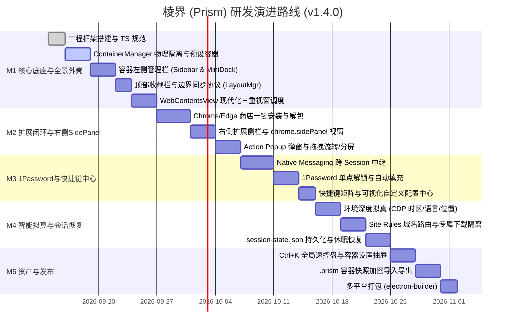

# 棱界 (Prism) — 核心功能需求与系统设计规范 (PRD & Functional Spec)

> **版本**：v1.4.0 (工程实施级终审版)  
> **状态**：Final Approved / 已终审确认  
> **代号**：Prism (棱界)  
> **核心标语**：一束光，多重身份。一个浏览器，多个并行的“我”。

---

## 目录
1. [产品愿景与系统全景](#1-产品愿景与系统全景)
2. [全景环绕工作台与视窗边界同步协议](#2-全景环绕工作台与视窗边界同步协议)
3. [多容器物理隔离与深度环境拟真体系](#3-多容器物理隔离与深度环境拟真体系)
4. [以容器为核心的左侧页面管理栏与设置抽屉](#4-以容器为核心的左侧页面管理栏与设置抽屉)
5. [容器感知型顶部收藏夹系统](#5-容器感知型顶部收藏夹系统)
6. [右侧扩展侧栏与 SidePanel 视窗体系](#6-右侧扩展侧栏与-sidepanel-视窗体系)
7. [官方扩展商店一键安装与插件作用域系统](#7-官方扩展商店一键安装与插件作用域系统)
8. [1Password 跨容器密码协同中继架构](#8-1password-跨容器密码协同中继架构)
9. [智能路由、数据边界与极客效率系统](#9-智能路由数据边界与极客效率系统)
10. [全键盘快捷键矩阵与可视化自定义配置中心](#10-全键盘快捷键矩阵与可视化自定义配置中心)
11. [会话持久化与崩溃恢复引擎](#11-会话持久化与崩溃恢复引擎)
12. [安全防护、防关联与容器资产便携化](#12-安全防护防关联与容器资产便携化)
13. [研发里程碑与演进规划 (v1.4.0)](#13-研发里程碑与演进规划-v140)

---

## 1. 产品愿景与系统全景

### 1.1 核心价值与定位
**Prism (棱界)** 面向开发者、跨境出海运营、独立创作者、安全研究员及多账号管理者，通过底层 Chromium Session Partitioning 切分物理会话，配合全景环绕式 UI，在单一浏览器内并行容纳多个完全独立、深度拟真的数字身份。
- **左翼（容器树状导航栏）**：以容器为一级工作空间，标签垂直层级排列，支持跨容器拖拽迁移与拖拽左右分屏；
- **顶穹（地址导航栏 + 容器感知收藏栏）**：集成地址输入、全局速控盘与绑定容器属性的智能分流书签；
- **右翼（扩展侧栏与 SidePanel 视窗）**：常驻扩展坞，支持 1Password 凭据速查、AI 辅助对话与沉浸式翻译常驻侧视窗；
- **中心（主渲染视窗）**：单视窗或双容器 Split View 1:1 并行比对；
- **内核（物理隔离与环境拟真）**：Cookie/Storage 彻底解耦，IP、时区、语言、经纬度及 DoH 全链路防关联。

---

## 2. 全景环绕工作台与视窗边界同步协议

### 2.1 全景工作台 UI 拓扑图
```text
┌─────────────────────────────────────────────────────────────────────────────┐
│ 顶部地址导航栏: [◀] [▶] [⟳] [🟦 工作主舱] https://github.com/... [Ctrl+K] [🧩][⚙]  │
├─────────────────────────────────────────────────────────────────────────────┤
│ 顶部收藏栏: 📁 工作常用  ★ GitHub  ★ Jira  ★ AWS控制台  |  🌐 [切换容器书签]   │
├──────────────┬──────────────────────────────────────────────┬───────────────┤
│ 容器左侧栏   │                                              │ 右侧扩展侧栏  │
│ (Sidebar)    │                                              │ (Ext Dock)    │
│ 🟦 工作主舱   │                                              │ 🔐 1Password  │
│   📌 企业邮箱│              WebContentsView                 │ 🤖 AI 助手    │
│   📌 GitHub  │                中心主网页视窗                │ 🌐 沉浸式翻译 │
│   📄 内部Jira│            (单视窗 或 左右分屏)              │ 📝 随手记/剪藏│
│ ──────────── │                                              │ ───────────── │
│ 🟩 私人空间   │                                              │ [➕ 发现扩展]  │
│   📌 B站     │                                              │ [⇥ 折叠/收起] │
└──────────────┴──────────────────────────────────────────────┴───────────────┘
```

### 2.2 视窗动态布局与边界同步协议 (Layout Bounds Sync Protocol)
在 Electron 中，`WebContentsView` 是 Chromium 原生视窗覆盖层，**非 DOM 节点**。为了保证窗口拉伸、侧栏收起、SidePanel 展开时中心网页与外壳 DOM 100% 严丝合缝，主进程实行统一的 `LayoutManager` 几何计算协议：

$$\begin{aligned}
X_{\text{main}} &= W_{\text{sidebar}} \\
Y_{\text{main}} &= H_{\text{navbar}} + (H_{\text{bookmarks}} \times \text{isBookmarksVisible}) \\
W_{\text{main}} &= W_{\text{window}} - W_{\text{sidebar}} - W_{\text{rightDock}} - (W_{\text{sidePanel}} \times \text{isSidePanelOpen}) \\
H_{\text{main}} &= H_{\text{window}} - Y_{\text{main}}
\end{aligned}$$

- **双分屏 (Split View) 几何派生**：
  - 左屏：$X = X_{\text{main}}, W = \lfloor W_{\text{main}} \times \text{splitRatio} \rfloor$
  - 右屏：$X = X_{\text{main}} + \lfloor W_{\text{main}} \times \text{splitRatio} \rfloor + 1, W = W_{\text{main}} - \text{LeftWidth} - 1$
- **IPC 节流同步机制**：
  - 渲染层 React Shell 在 DOM 尺寸发生变化（ResizeObserver / 动画帧）时，通过 `ipcRenderer.send('layout:update-bounds', boundsPayload)` 异步发送；
  - 主进程采用 `requestAnimationFrame` 驱动 `view.setBounds(...)`，消除拉伸时的白边与撕裂感。

---

## 3. 多容器物理隔离与深度环境拟真体系

### 3.1 容器数据模型 (Container Definition)
```typescript
export interface ContainerDefinition {
  id: string;                      // 容器唯一 ID (如: "work", "us-social")
  name: string;                    // 容器名称 (如: "工作主舱", "北美社媒")
  color: string;                   // 容器专属主题色 HEX (如: "#3B82F6")
  icon: string;                    // 容器图标标识符 (Lucide: "Briefcase", "User", etc.)
  partition: string;               // Chromium 分区标识: `persist:prism_${id}`
  isPrivate: boolean;              // 阅后即焚模式 (内存分区，退出即销毁)
  isCollapsed?: boolean;           // 在左侧管理栏中是否折叠
  proxyConfig?: {                  // 专属网络出口代理
    enabled: boolean;
    type: 'http' | 'https' | 'socks5';
    host: string;
    port: number;
    username?: string;
    password?: string;
  };
  environmentOverrides?: {         // 深度环境拟真配置
    timezoneId?: string;           // 时区 (如 "America/New_York")
    locale?: string;               // 语言与区域 (如 "en-US")
    geolocation?: {                // 经纬度地理位置
      latitude: number;
      longitude: number;
      accuracy: number;
    };
    userAgent?: string;            // 独立 User-Agent
  };
  downloadSubpath?: string;        // 容器专属独立下载子目录
  createdAt: number;
}
```

### 3.2 首次启动预置容器 (First-Run Presets)
初次启动 Prism 时，自动初始化 4 个典型场景容器：
1. 🟦 **工作主舱 (Work)**：主题色 `#3B82F6`，图标 `Briefcase`，直连/企业代理，预置企业书签。
2. 🟩 **个人空间 (Personal)**：主题色 `#10B981`，图标 `User`，日常媒体娱乐，私密隔离。
3. 🟨 **跨境出海 (Global)**：主题色 `#F59E0B`，图标 `Globe`，美区时区/语言预设，支持代理绑定。
4. 🟣 **极客沙箱 (Sandbox)**：主题色 `#8B5CF6`，图标 `Flame`，纯内存临时分区 (`isPrivate: true`)，随手测试。

### 3.3 深度环境拟真防风控规范
- **CDP 时区注入**：对目标容器 WebContents 附加 CDP 会话，执行 `Emulation.setTimezoneOverride({ timezoneId })`，确保前端 JS 的 `Intl.DateTimeFormat` 与代理出口严格一致。
- **地理位置模拟**：执行 `Emulation.setGeolocationOverride`，拦截 HTML5 定位请求。
- **DoH (DNS-over-HTTPS)**：集成 Cloudflare / Google DoH 安全解析，阻断本地运营商 DNS 审计与跨域泄露。

---

## 4. 以容器为核心的左侧页面管理栏与设置抽屉

### 4.1 容器左侧管理栏树状交互
- **分组头部 (Header)**：主题色边条、图标、名称、实时网络药丸（显示代理延迟 `🟢 38ms`）、`[+]` 专属新建标签、`[💤]` 容器级一键休眠、`[⚙]` 容器设置。
- **分组项 (Items)**：上部为紧凑「固定常用项 (Pinned Tabs)」，下部为「普通浏览标签 (Open Tabs)」，带标题、Favicon、未读红点与休眠状态。
- **双模态切换**：
  - **全展开树状模式**：默认 240px，支持鼠标左右拉伸调整宽度；
  - **紧凑迷你坞模式 (Mini Dock)**：折叠为 48px，仅展示垂直彩色圆形徽标，鼠标 Hover 滑出轻量抽屉。

### 4.2 容器设置抽屉 (Container Inspector Drawer)
点击容器头部的 `[⚙]` 图标，从左侧滑出专属配置抽屉：
- **外观定制**：修改容器名称、从 12 款现代化主题色板中选择、选择 Lucide 图标；
- **网络与环境**：配置专属代理（支持连通性实时测试 Ping）、覆盖时区与语言；
- **数据管理**：
  - 🧹 **一键清洗**：调用 `session.clearStorageData()` 清理该容器 Cookies/Cache；
  - 🔒 **导出备份**：一键导出该容器快照为 `.prism` 文件；
  - 🗑️ **销毁容器**：删除容器及物理持久化目录。

### 4.3 跨容器拖拽流转与分屏联动
- **拖拽改容器 (Drag-to-Migrate)**：在左侧栏按住任意标签拖入另一容器，底层自动迁移会话。
- **拖拽触发分屏 (Drag-to-Split)**：按住左侧标签向右拖入主视窗，出现分屏高亮落入区，松开即形成左右 1:1 双容器分屏。

---

## 5. 容器感知型顶部收藏夹系统

### 5.1 布局与快捷操作
- 快捷键 `Ctrl + Shift + B` (Windows/Linux) 或 `Cmd + Shift + B` (macOS) 极速显隐。
- 支持树状文件夹层级、网页 Favicon 与自适应文字排版。

### 5.2 容器感知与智能分流 (Container-Aware Bookmarks)
- **容器属性绑定**：用户保存书签时可勾选“绑定到特定容器”（如 AWS 控制台绑定至【工作主舱】）；
- **跨容器智能调度**：在任何容器中点击已绑定的书签，Prism 自动切换到目标容器并在其中打开，杜绝串号；
- **双模态视图**：支持“当前容器专属书签”与“全局聚合书签”一键切换。

---

## 6. 右侧扩展侧栏与 SidePanel 视窗体系

### 6.1 核心价值与场景
彻底解决 Action Popup 临时浮窗“失焦即关闭”的痛点，为 1Password 速查、AI 助手对话、沉浸式翻译等高频插件提供常驻并行的原生侧视窗。

### 6.2 扩展侧栏架构设计 (Right-Side Extension Dock)
1. **40px 垂直扩展坞**：垂直排列当前容器生效的所有扩展图标，顶部提供折叠按钮，底部提供添加扩展入口。
2. **独立 SidePanel 侧视窗**：
   - 点击图标向左展开 320px ~ 500px 可调视窗；
   - **原生 API 兼容**：主进程读取扩展 `manifest.json` 中的 `side_panel.default_path`，挂载为独立 `WebContentsView`，并注入 `chrome.sidePanel` 原生上下文对象，官方商店插件 100% 免改动运行；
   - **双视窗并列协作**：主网页与右侧扩展视窗同时保持活跃交互，不互相遮挡。

---

## 7. 官方扩展商店一键安装与插件作用域系统

### 7.1 官方商店一键直装链路
- 支持 **Chrome 网上应用店** 与 **Microsoft Edge 加载项**。
- Content Script 拦截商店页面【添加至 Chrome】/【获取】动作，提取 `Extension ID`。
- 弹出 Prism 原生安装抽屉，自动下载官方 CRX3 二进制包，解压 ZIP 资源至安全目录，热加载注入目标 Session。

### 7.2 插件作用域分层体系
- **全局模式 (Global)**：1Password, uBlock Origin, Dark Reader（全容器自动共享）。
- **容器专属模式 (Scoped)**：指定容器独占加载，保证环境轻量。
- **本地扩展加载**：支持拖拽本地 `.crx` 或载入已解压的目录（Sideloading）。

---

## 8. 1Password 跨容器密码协同中继架构

### 8.1 Windows / macOS 底层 Native Messaging 管道中继
- **Windows 注册表与 Host 路径**：  
  1Password 官方注册项位于 `HKEY_CURRENT_USER\Software\Google\Chrome\NativeMessagingHosts\2b6a27fd_d595_4e08_8a20_324460b130e0`。
- **虚拟 IPC 代理中继**：
  - Prism 主进程启动一个标准 stdio 代理桥（NativeRelayServer）；
  - 向各容器 Session 内的 1Password 扩展实例暴露虚拟 `chrome.runtime.connectNative` 接口；
  - 所有容器实例通过主进程与本机的 1Password 桌面端建立单条受保护长连接。

### 8.2 用户体验闭环
- **单点认证，全局解锁**：任意容器通过指纹（Windows Hello / Touch ID）或主密码解锁一次，全浏览器所有容器同步保持已解锁。
- **上下文凭据匹配**：根据所在容器属性自动推荐匹配的工作或个人账号，表单填充仅作用于当前标签 DOM。

---

## 9. 智能路由、数据边界与极客效率系统

- **智能域名路由 (Site Rules)**：通配符/正则规则自动派发至指定容器。
- **专属下载目录隔离**：按容器自动分流下载路径，下载文件带容器色彩标记。
- **棱镜全局命令面板 (Ctrl + K)**：全键盘秒切容器、开启分屏、切换代理、清洗缓存、模糊搜索全部标签与收藏。

---

## 10. 全键盘快捷键矩阵与可视化自定义配置中心

### 10.1 系统默认快捷键标准矩阵

| 分类 | 快捷键 (Windows/Linux) | 快捷键 (macOS) | 动作说明 |
| :--- | :--- | :--- | :--- |
| **视窗与布局** | `Ctrl + \` | `Cmd + \` | 切换左侧管理栏形态 (全展开 ↔ 迷你坞) |
| | `Ctrl + Shift + E` | `Cmd + Shift + E` | 展开 / 收起右侧扩展 SidePanel |
| | `Ctrl + Shift + B` | `Cmd + Shift + B` | 显隐顶部收藏栏 |
| | `Ctrl + Shift + S` | `Cmd + Shift + S` | 开启 / 退出双容器左右分屏 (Split View) |
| **容器切换** | `Alt + Up / Down` | `Option + Up / Down`| 快速在相邻容器之间纵向切换 |
| | `Ctrl + Alt + 1~9` | `Cmd + Option + 1~9`| 直接跳转至第 1~9 个容器 |
| **标签调度** | `Ctrl + T` | `Cmd + T` | 在当前活动容器内新建标签页 |
| | `Ctrl + W` | `Cmd + W` | 关闭当前活动标签页 |
| | `Ctrl + Shift + T` | `Cmd + Shift + T` | 重新打开刚刚关闭的标签 (继承原容器) |
| | `Ctrl + 1~8` | `Cmd + 1~8` | 跳转至当前容器的第 1~8 个标签 |
| | `Ctrl + 9` | `Cmd + 9` | 跳转至当前容器的最后一个标签 |
| **效率与导航** | `Ctrl + K` | `Cmd + K` | 唤出 Prism 棱镜全局命令面板 |
| | `Ctrl + L` / `Alt + D` | `Cmd + L` | 光标聚焦顶部智能地址栏 |
| | `Alt + Left / Right` | `Cmd + [ / ]` | 网页后退 / 前进 |
| | `Ctrl + R` / `F5` | `Cmd + R` | 刷新当前网页 |
| | `Ctrl + Shift + X` | `Cmd + Shift + X` | 唤醒 1Password 扩展自动填充 |

### 10.2 可视化快捷键配置中心 (Shortcuts Settings Page)
- **配置界面入口**：通过 `Ctrl + K` 搜索“快捷键设置”或点击浏览器设置图标进入。
- **交互功能规范**：
  1. **分类检索**：支持按“视窗布局”、“容器切换”、“标签调度”、“扩展命令”分组筛选与关键词实时搜索；
  2. **可视化按键捕获器 (Key Recorder)**：点击任意快捷键输入框，按下新键位组合（自动识别 Ctrl、Alt、Shift、Meta 及主键），即时捕获；
  3. **按键冲突检测**：若新快捷键与已有系统命令或已安装插件快捷键冲突，高亮红色警示并提示冲突项名称；
  4. **一键重置**：支持单个动作恢复默认或全局“一键恢复默认快捷键”；
  5. **持久化落盘**：配置保存于 `<userData>/Prism/config/shortcuts.json`，修改即刻热重载生效。

---

## 11. 会话持久化与崩溃恢复引擎

### 11.1 会话状态数据模型 (`session-state.json`)
```typescript
export interface SessionStateSnapshot {
  version: '1.4.0';
  timestamp: number;
  activeContainerId: string;
  splitViewState?: {
    isOpen: boolean;
    leftTabId: string;
    rightTabId: string;
    splitRatio: number;
  };
  containers: Array<{
    id: string;
    isCollapsed: boolean;
    activeTabId: string;
    tabs: Array<{
      id: string;
      url: string;
      title: string;
      faviconUrl?: string;
      isPinned: boolean;
      isHibernated: boolean;
      lastAccessedAt: number;
    }>;
  }>;
}
```

### 11.2 自动保存与无感恢复流程
1. **防抖原子写入**：
   - 监听标签创建、切换、关闭、导航完成事件，5 秒防抖写入；
   - 窗口退出事件（`before-quit`）触发即时同步写入。
2. **轻量无感唤醒**：
   - 启动时读取 `session-state.json` 重构左侧容器与标签树；
   - **后台标签默认以休眠态 (Hibernated) 恢复**：仅挂载前台活跃的 1~2 个 `WebContentsView`，其余标签保持图标与标题展示，点击时秒级唤醒，内存开销为 0。

---

## 12. 安全防护、防关联与容器资产便携化

- **防指纹探测噪声**：Canvas / WebGL / AudioContext 微小数学噪声混淆。
- **容器资产便携快照 (`.prism`)**：AES-256-GCM 加密打包导出整个容器的 Cookie、LocalStorage 与插件配置，换机一键复原。

---

## 13. 研发里程碑与演进规划 (v1.4.0)



### 里程碑交付标准
- **M1（第 1~2 周）**：跑通多容器物理隔离底座、4 组开箱预设容器、左侧容器树状栏、顶部收藏栏与视窗边界同步协议。
- **M2（第 3~4 周）**：跑通 Chrome 商店一键直装、右侧扩展 SidePanel 视窗、拖拽改容器与左右分屏。
- **M3（第 5~6 周）**：打通 1Password 跨容器 Native Messaging 中继，并交付可视化快捷键自定义配置页面。
- **M4（第 7~8 周）**：完成 CDP 深度拟真、Site Rules 智能路由与会话崩溃恢复引擎。
- **M5（第 9~10 周）**：全局命令面板、容器设置抽屉、`.prism` 加密备份与打包交付。
