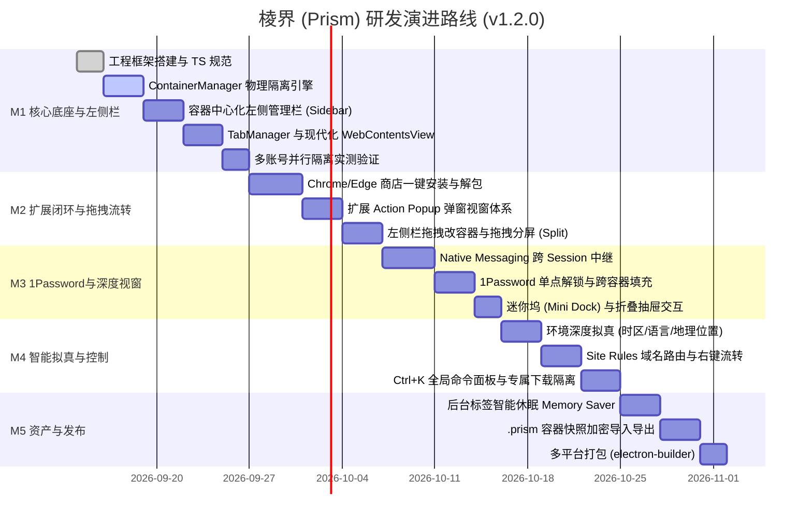

# 棱界 (Prism) — 核心功能需求与系统设计规范 (PRD & Functional Spec)

> **版本**：v1.2.0 (左侧容器管理栏与交互全闭环版)  
> **状态**：Official Spec / 已审定  
> **代号**：Prism (棱界)  
> **核心标语**：一束光，多重身份。一个浏览器，多个并行的“我”。

---

## 目录
1. [产品愿景与系统全景](#1-产品愿景与系统全景)
2. [总体系统架构与布局模型](#2-总体系统架构与布局模型)
3. [多容器物理隔离与深度环境拟真体系](#3-多容器物理隔离与深度环境拟真体系)
4. [以容器为核心的左侧管理栏与视窗调度系统](#4-以容器为核心的左侧管理栏与视窗调度系统)
5. [官方扩展商店一键安装与插件交互闭环](#5-官方扩展商店一键安装与插件交互闭环)
6. [插件容器级作用域与隔离调度系统](#6-插件容器级作用域与隔离调度系统)
7. [1Password 跨容器密码协同中继架构](#7-1password-跨容器密码协同中继架构)
8. [智能路由、数据边界与极客效率系统](#8-智能路由数据边界与极客效率系统)
9. [安全防护、防关联与容器资产便携化](#9-安全防护防关联与容器资产便携化)
10. [研发里程碑与演进规划 (v1.2.0)](#10-研发里程碑与演进规划-v120)

---

## 1. 产品愿景与系统全景

### 1.1 核心价值与定位
**Prism (棱界)** 像三棱镜折射单束白光为七彩光谱一样，将现代专业用户（开发者、独立出海创作者、跨境运营、安全研究员及多账号管理者）的单一工作视窗，折射为多个平行的物理隔离数字身份容器。
- **物理隔离**：底层基于 Chromium Session Partition 独立物理持久化，彻底杜绝同站多账号串号与数据污染。
- **深度拟真**：IP、时区、语言、地理位置全链路模拟，彻底规避现代云平台与社媒平台的跨账号风控侦测。
- **以容器为核心的左侧管理栏**：打破传统浏览器顶部标签挤压与多容器混杂的痛点，以容器分组垂直树状呈现所有页面，支持拖拽跨容器流转与一键拖拽分屏。
- **无缝插件**：突破 Electron 生态壁垒，支持 Chrome/Edge 官方商店直接点击安装，具备 Action Popup 弹窗视窗，并打通 1Password 跨容器单点解锁。
- **极致效能**：现代 `BaseWindow + WebContentsView` 视窗架构，双容器分屏实时比对，后台标签智能休眠与 `Ctrl+K` 全键盘速控盘。

---

## 2. 总体系统架构与布局模型

### 2.1 浏览器整体交互布局 (UI Layout)
Prism 创新采用**以容器为核心单元的左侧页面管理栏**作为标志性布局（同时允许用户一键切换回经典顶部栏）：

```text
┌──────────────┬────────────────────────────────────────────────────────┐
│ 容器左侧栏   │ 顶部工具栏: [◀] [▶] [⟳]  [🟦 工作主舱] https://github.com/... [🧩][⚙]│
├──────────────┼────────────────────────────────────────────────────────┤
│ 🟦 工作主舱   │                                                        │
│   📌 企业邮箱│                                                        │
│   📌 GitHub  │                                                        │
│   📄 内部Jira│                                                        │
│   ➕ 新建页面│                                                        │
│ ──────────── │                                                        │
│ 🟩 私人空间   │                  WebContentsView 网页主视窗            │
│   📌 YouTube │                     (单视窗 或 左右分屏)               │
│   📄 Twitter │                                                        │
│ ──────────── │                                                        │
│ 🟨 跨境出海   │                                                        │
│   🌐 [US 代理]│                                                        │
│   📄 亚马逊  │                                                        │
│ ──────────── │                                                        │
│ ⚙️ 容器管理   │                                                        │
└──────────────┴────────────────────────────────────────────────────────┘
```

### 2.2 核心调度分层架构
```mermaid
graph TD
    subgraph UI_Shell [浏览器外壳 Shell (React 18 + Tailwind CSS v4)]
        LeftSidebar[以容器管理的左侧管理栏 & MiniDock]
        TopNavBar[智能地址导航栏 & 容器身份胶囊]
        ExtTray[扩展工具栏托盘 & Action Popup 浮窗]
        CommandBar[Ctrl+K 棱镜全局命令面板]
    end

    subgraph Main_Core [主进程核心调度引擎 (Electron 33+ Main)]
        SidebarState[左侧容器与标签树状态机]
        TabMgr[TabManager WebContentsView 调度与休眠器]
        SplitMgr[SplitViewManager 双容器分屏调度]
        ContainerMgr[ContainerManager 容器与环境引擎]
        ExtensionMgr[ExtensionManager 扩展全生命周期]
        NativeRelay[1Password Native Messaging 跨域中继]
        RuleEngine[SiteRuleEngine 智能域名路由]
        DownloadMgr[ScopedDownloadManager 路径隔离]
    end

    subgraph Storage_Partitions [底层物理隔离会话层 (Chromium Sessions)]
        SessDefault[Session: Default]
        SessWork["Session: persist:prism_work (时区/代理/Cookie独立)"]
        SessPersonal["Session: persist:prism_personal (个人日常)"]
        SessClient["Session: persist:prism_client (跨境/客户沙箱)"]
    end

    UI_Shell -->|IPC 通信| Main_Core
    TabMgr -->|挂载/休眠 WebContentsView| Storage_Partitions
    SplitMgr -->|双分屏绑定| Storage_Partitions
    ExtensionMgr -->|loadExtension & 弹窗| Storage_Partitions
    NativeRelay <-->|跨 Session stdio 桥接| Storage_Partitions
```

---

## 3. 多容器物理隔离与深度环境拟真体系

### 3.1 容器数据模型 (Container Definition)
```typescript
export interface ContainerDefinition {
  id: string;                      // 容器唯一 ID (如: "work", "us-social")
  name: string;                    // 容器名称 (如: "工作主舱", "北美社媒")
  color: string;                   // 容器专属主题色 HEX (如: "#3B82F6")
  icon: string;                    // 容器图标 (Lucide Icon 标识符)
  partition: string;               // Chromium 分区标识: `persist:prism_${id}`
  isPrivate: boolean;              // 阅后即焚模式 (内存分区，退出即销毁)
  isCollapsed?: boolean;           // 在左侧管理栏中是否处于折叠状态
  proxyConfig?: ProxyRule;         // 专属网络出口 (HTTP/SOCKS5 + 认证)
  environmentOverrides?: {         // 深度环境拟真配置
    timezoneId?: string;           // 时区 (如 "America/New_York")
    locale?: string;               // 语言与区域 (如 "en-US")
    geolocation?: {                // 经纬度地理位置
      latitude: number;
      longitude: number;
      accuracy: number;
    };
    userAgent?: string;            // 独立 User-Agent
  };
  downloadSubpath?: string;        // 容器专属独立下载子目录
  createdAt: number;
}
```

### 3.2 物理隔离与环境拟真规范
1. **彻底解耦的存储树**：`session.fromPartition` 独立持久化私有的 Cookies、IndexedDB、LocalStorage、SessionStorage、CacheStorage、Service Workers，跨容器绝不串号。
2. **CDP 级时区与位置拟真**：主进程通过 Chrome DevTools Protocol (CDP) 为每个容器注入 `Emulation.setTimezoneOverride` 与 `Emulation.setGeolocationOverride`，配合专属代理 IP，彻底阻断网页 JS 的时区/IP 不一致风控检测。
3. **HTTP 语言标头与 DoH**：动态覆盖 `Accept-Language` 与 `navigator.languages`，同时通过安全 DNS (DoH) 杜绝域名查询本地泄漏。

---

## 4. 以容器为核心的左侧管理栏与视窗调度系统

### 4.1 容器中心化左侧管理栏 (Container-Centric Left Sidebar)
为了彻底解决标签混杂与纵向空间浪费，Prism 将**容器作为管理的第一层级 (First-Class Citizen)**：

#### 1. 结构化层次
- **容器分组卡片 (Container Section Header)**：
  - **色彩与图标**：容器专属主题色边条、图标与名称；
  - **网络状态药丸**：悬浮/常驻展示当前容器代理出口（如 `🟢 US-West 45ms`），点击可快速切换节点；
  - **快捷操作**：`[+]` 容器内专属新建标签、`[💤]` 一键休眠该容器非活跃页面、`[🧹]` 清洗缓存；
  - **折叠/展开**：点击容器头部可自由折叠收起该容器的所有标签，保持工作区清爽。
- **分组内标签项 (Tab Items)**：
  - **固定常用项 (Pinned Tabs)**：容器内高频使用的页面（如企业邮箱、Slack），以紧凑图标行排布；
  - **普通标签页 (Open Tabs)**：完整展示 Favicon、网页标题、未读红点及休眠状态图标（月亮标识）；
  - **右键上下文菜单**：提供“移至其他容器”、“休眠此标签”、“在新分屏打开”等选项。

#### 2. 双重视窗布局模式
- **全展开树状模式 (Full Tree Mode)**：默认宽度 240px，支持鼠标拖拽自由调节侧栏宽度。
- **紧凑迷你坞模式 (Compact Mini Dock)**：
  - 一键折叠为 48px 极窄栏，仅垂直排列容器的彩色圆形徽标与未读标签数量；
  - 鼠标 Hover 悬浮或点击容器图标时，以轻量抽屉（Floating Drawer）形式平滑滑出该容器标签，网页视窗获得 100% 完整屏宽。
- **双模态自由切换**：用户可在偏好设置中选择【左侧容器栏（默认）】或【经典顶部横向标签栏】。

### 4.2 跨容器拖拽流转与分屏联动 (Drag & Drop Orchestration)
1. **拖拽跨容器迁移 (Drag-to-Migrate)**：
   - 用户可直接在左侧栏按住任意标签，拖拽放入另一个容器卡片下；
   - Prism 主进程在目标容器的 Session 中瞬间重建该 URL 的 `WebContentsView` 并无缝继承历史记录，完成身份的跨容器流转。
2. **拖拽触发双容器分屏 (Drag-to-Split)**：
   - 用户按住左侧栏的某个标签向右侧主网页视窗拖动；
   - 主视窗出现半透明的分屏蓝色落入区（左右 50:50）；
   - 松开鼠标后立即形成左右分屏：左侧显示原页面，右侧展示拖入的页面（且两侧可处于完全不同的容器环境）。

### 4.3 双容器并行分屏 (Split View)
- 支持单窗口内左右等分、比例调节（30:70 / 70:30）或上下分屏。
- 两个分屏视图分别绑定不同的容器 `WebContentsView`，硬件加速独立渲染，互不影响滚动与交互。

### 4.4 标签智能休眠 (Memory Saver / Tab Discarding)
- **休眠生命周期**：前台活跃 (Active) ➔ 后台就绪 (Inactive) ➔ 深度休眠 (Hibernated，闲置超 20 分钟自动卸载 WebContents 释放内存) ➔ 唤醒秒级恢复 (Restoring)。
- 内存开销降低 60% 以上，常驻 50+ 标签不卡顿。

---

## 5. 官方扩展商店一键安装与插件交互闭环

### 5.1 官方商店直接一键安装
- 支持 **Chrome 网上应用店** 与 **Edge 加载项商店**。
- Content Script 拦截商店页面【添加至 Chrome】/【获取】动作，提取 `Extension ID`。
- 弹出 Prism 原生授权抽屉，确认后自动通过 Google/Edge 官方端点下载二进制 `.crx`，解压 CRX3 ZIP 资源到专用安全目录，无缝热加载注入目标 Session。

### 5.2 扩展工具栏与 Action Popup（弹窗视窗）
- 顶部导航栏右侧构建动态扩展托盘，展示插件图标。
- 点击插件图标时，主进程计算图标坐标，在下方以浮动形式挂载轻量无边框子视图（Action Popup View），直接渲染插件的 `default_popup.html`，失焦自动销毁，原生支持 1Password、MetaMask、沉浸式翻译等插件。

### 5.3 扩展快捷键与离线导入
- 支持 `chrome.commands` 扩展全局快捷键（如 `Ctrl+Shift+X` 唤醒 1Password）。
- 支持直接拖拽本地 `.crx` 或加载已解压的目录（Sideloading）。

---

## 6. 插件容器级作用域与隔离调度系统

| 作用域模式 | 适用插件 | 运行机制 |
| :--- | :--- | :--- |
| **全局模式 (Global)** | 1Password, uBlock Origin, Dark Reader | 所有已存在容器及新建容器均自动载入该插件 |
| **容器专属模式 (Scoped)** | 工作内网助手、特定海外平台运营插件 | 仅在指定勾选的容器 Session 中挂载，其他容器保持纯净 |
| **开发者模式 (DevOnly)** | React DevTools, Redux DevTools | 仅在指定开发容器挂载，免除日常浏览的性能损耗 |

---

## 7. 1Password 跨容器密码协同中继架构

### 7.1 Native Messaging 跨 Session 中继
- 主进程中继核心独占与操作系统 1Password 桌面客户端的 stdio 管道。
- 代理各容器内 1Password 扩展实例的原生握手包。
- **单点认证，全局解锁**：任意容器内完成一次指纹或密码解锁，全浏览器所有容器同步保持已解锁。
- **多账号上下文自动匹配**：依据当前所在容器属性，优先推荐并自动填充对应的账号密码。

---

## 8. 智能路由、数据边界与极客效率系统

### 8.1 智能域名路由引擎 (Site Rules Engine)
- 支持通配符与正则规则（如 `*.corp.google.com` 强制在【工作主舱】打开）。
- 误在其他容器打开时，自动平滑重定向至指定容器的标签页。

### 8.2 容器专属下载隔离 (Scoped Download Manager)
- 每个容器独立配置下载目录（如 `Downloads/Prism-Work/`），下载记录带有容器色彩标。

### 8.3 棱镜全局命令面板 (Ctrl + K)
- 全局呼出速控盘，支持：全键盘切换容器、开启分屏、切换代理、清洗缓存、模糊搜索全部标签。

---

## 9. 安全防护、防关联与容器资产便携化

### 9.1 防指纹探测与噪声 (Anti-Fingerprinting)
- 容器级 Canvas / WebGL / AudioContext 微小数学噪声混淆，破坏指纹追踪。
- WebRTC 穿透抑制，防止局域网私有 IP 泄露。

### 9.2 容器资产便携快照 (`.prism` 归档)
- 支持将指定容器的 Cookie、LocalStorage、扩展映射及偏好加密打包导出为 `.prism` 备份文件（AES-256-GCM 加密），便于团队迁移或换机恢复。
- 内置“跨境出海”、“企业办公”、“极客沙箱”开箱即用预设模版。

---

## 10. 研发里程碑与演进规划 (v1.2.0)



### 里程碑交付标准
- **M1（第 1~2 周）**：跑通多容器物理隔离，左侧容器树状管理栏与 WebContentsView 调度，完成同站多账号并行登录验证。
- **M2（第 3~4 周）**：跑通 Chrome 商店一键直装 CRX3、Action Popup 弹窗视窗、左侧栏拖拽改容器与拖拽左右分屏。
- **M3（第 5~6 周）**：打通 1Password 跨容器 Native Messaging 中继与自动填充，实现左侧迷你坞 (Mini Dock) 紧凑模式。
- **M4（第 7~8 周）**：完成 CDP 时区/语言/位置深度拟真、Site Rules 智能路由与 `Ctrl+K` 全局命令面板。
- **M5（第 9~10 周）**：标签休眠优化、`.prism` 加密备份导入导出与跨平台构建打包。
