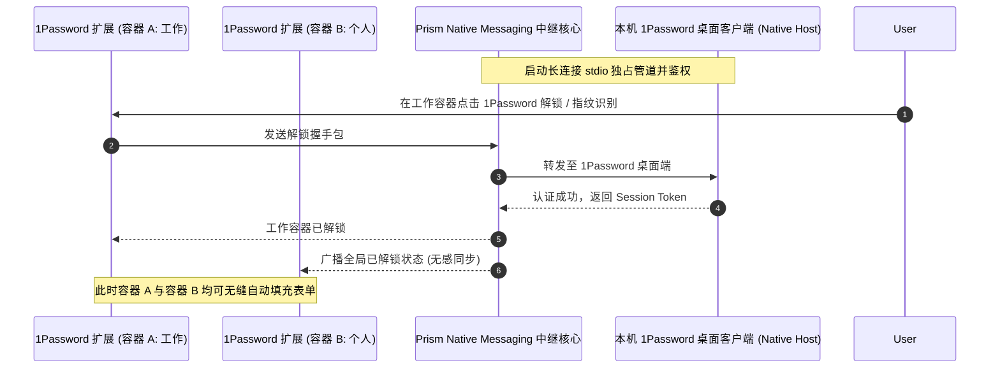
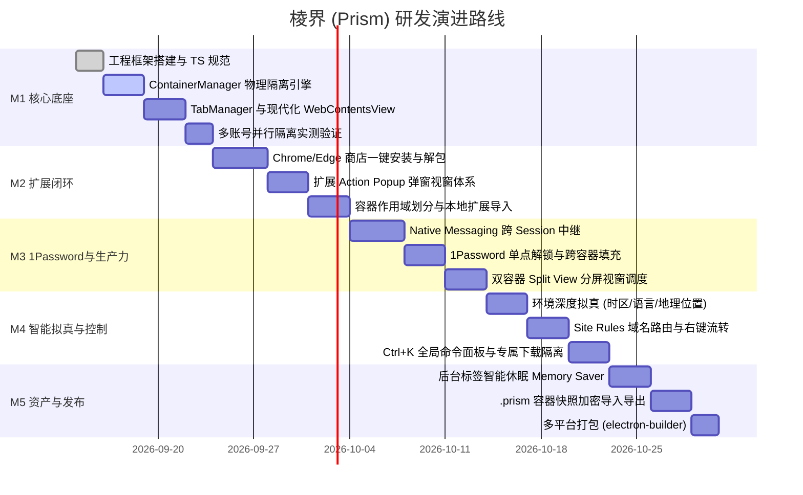

# 棱界 (Prism) — 核心功能需求与系统设计规范 (PRD & Functional Spec)

> **版本**：v1.1.0 (全功能增强版)  
> **状态**：Official Spec / 已审定  
> **代号**：Prism (棱界)  
> **核心标语**：一束光，多重身份。一个浏览器，多个并行的“我”。

---

## 目录
1. [产品愿景与系统全景](#1-产品愿景与系统全景)
2. [总体系统架构与技术选型](#2-总体系统架构与技术选型)
3. [多容器物理隔离与深度环境拟真体系](#3-多容器物理隔离与深度环境拟真体系)
4. [生产力标签视窗、分屏与内存管理系统](#4-生产力标签视窗分屏与内存管理系统)
5. [官方扩展商店一键安装与插件交互闭环](#5-官方扩展商店一键安装与插件交互闭环)
6. [插件容器级作用域与隔离调度系统](#6-插件容器级作用域与隔离调度系统)
7. [1Password 跨容器密码协同中继架构](#7-1password-跨容器密码协同中继架构)
8. [智能路由、数据边界与极客效率系统](#8-智能路由数据边界与极客效率系统)
9. [安全防护、防关联与容器资产便携化](#9-安全防护防关联与容器资产便携化)
10. [研发里程碑与演进规划 (v1.1.0)](#10-研发里程碑与演进规划-v110)

---

## 1. 产品愿景与系统全景

### 1.1 核心价值与定位
**Prism (棱界)** 像三棱镜折射单束白光为七彩光谱一样，将现代专业用户（开发者、独立出海创作者、跨境运营、安全研究员及多账号管理者）的单一工作视窗，折射为多个平行的物理隔离数字身份容器。
- **物理隔离**：底层基于 Chromium Session Partition 独立物理持久化，彻底杜绝同站多账号串号与数据污染。
- **深度拟真**：IP、时区、语言、地理位置全链路模拟，彻底规避现代云平台与社媒平台的跨账号风控侦测。
- **无缝插件**：突破 Electron 生态壁垒，支持 Chrome/Edge 官方商店直接点击安装，具备 Action Popup 弹窗视窗，并打通 1Password 跨容器单点解锁。
- **极致效能**：单窗口现代多视窗架构，支持双容器分屏并行比对，配合后台标签智能休眠与 `Ctrl+K` 全键盘速控盘。

---

## 2. 总体系统架构与技术选型

### 2.1 架构层次图
```mermaid
graph TD
    subgraph UI_Layer [渲染层 Browser Shell (React 18 + Tailwind CSS v4)]
        TabBar[色彩感知标签栏 & 分屏指示器]
        NavBar[智能地址导航栏 & 容器徽章]
        Sidebar[容器管理侧边栏 & 状态监控]
        ExtTray[扩展工具栏托盘 & Action Popup 浮窗]
        CommandBar[Ctrl+K 棱镜全局命令面板]
    end

    subgraph Core_Dispatch [主进程核心调度引擎 (Electron 33+ Main)]
        TabMgr[TabManager 标签调度与休眠器]
        SplitMgr[SplitViewManager 双容器分屏调度]
        ContainerMgr[ContainerManager 容器与环境引擎]
        ExtensionMgr[ExtensionManager 扩展全生命周期]
        NativeRelay[1Password Native Messaging 跨域中继]
        RuleEngine[SiteRuleEngine 智能域名路由]
        DownloadMgr[ScopedDownloadManager 路径隔离]
    end

    subgraph Storage_Partitions [底层物理隔离会话层 (Chromium Sessions)]
        SessDefault[Session: Default]
        SessWork["Session: persist:prism_work (时区/代理/Cookie独立)"]
        SessPersonal["Session: persist:prism_personal (个人日常)"]
        SessClient["Session: persist:prism_client (跨境/客户沙箱)"]
    end

    UI_Layer -->|IPC 通信| Core_Dispatch
    TabMgr -->|挂载/休眠 WebContentsView| Storage_Partitions
    SplitMgr -->|双分屏绑定| Storage_Partitions
    ExtensionMgr -->|loadExtension & 弹窗| Storage_Partitions
    NativeRelay <-->|跨 Session stdio 桥接| Storage_Partitions
```

### 2.2 技术选型标准
- **桌面宿主**：`Electron 33+` (基于 Chromium 130+ 现代引擎)
- **构建构建工具**：`electron-vite` (Vite 5+)
- **前端外壳**：`React 18` + `TypeScript 5` + `Tailwind CSS 4`
- **视窗渲染**：`BaseWindow` + `WebContentsView`（彻底淘汰废弃的 BrowserView 与安全隐患的 `<webview>`）
- **状态存储**：`Zustand` 响应式切片 + `Electron safeStorage` 本地加解密

---

## 3. 多容器物理隔离与深度环境拟真体系

### 3.1 容器数据模型 (Container Definition)
```typescript
export interface ContainerDefinition {
  id: string;                      // 容器唯一 ID (如: "work", "us-social")
  name: string;                    // 容器名称 (如: "工作主舱", "北美社媒")
  color: string;                   // 容器专属主题色 HEX (如: "#3B82F6")
  icon: string;                    // 容器图标 (Lucide Icon 标识符)
  partition: string;               // Chromium 分区标识: `persist:prism_${id}`
  isPrivate: boolean;              // 阅后即焚模式 (内存分区，退出即销毁)
  proxyConfig?: ProxyRule;         // 专属网络出口 (HTTP/SOCKS5 + 认证)
  environmentOverrides?: {         // 深度环境拟真配置
    timezoneId?: string;           // 时区 (如 "America/New_York")
    locale?: string;               // 语言与区域 (如 "en-US")
    geolocation?: {                // 经纬度地理位置
      latitude: number;
      longitude: number;
      accuracy: number;
    };
    userAgent?: string;            // 独立 User-Agent
  };
  downloadSubpath?: string;        // 容器专属独立下载子目录
  createdAt: number;
}
```

### 3.2 物理存储隔离规范
1. **全链路存储切割**：各容器 `session.fromPartition` 独立管理私有的 Cookies、IndexedDB、LocalStorage、SessionStorage、CacheStorage、Service Workers、WebSQL，杜绝任何形式的跨容器数据穿透。
2. **多账号并行实测指标**：支持在同一窗口并排打开 `Tab 1 (工作容器 Google)` 与 `Tab 2 (个人容器 Google)`，账号登录态 100% 独立，且长期刷新保持互不影响。
3. **一键深度净化 (Sanitize)**：支持单独对指定容器执行 `session.clearStorageData()` 清空全部或部分缓存，其他容器不受任何波及。

### 3.3 深度环境拟真与防风控联动 (Anti-Detection)
- **时区联动欺骗**：通过 Chrome DevTools Protocol (CDP) 的 `Emulation.setTimezoneOverride` 为目标容器注入指定时区，使 JS 的 `new Date().getTimezoneOffset()` 与代理 IP 属地完全契合。
- **语言与区域模拟**：自动拦截修改该容器所有 HTTP 请求头的 `Accept-Language`，并结合 CDP 覆盖 `navigator.languages`。
- **经纬度位置覆盖**：调用 `Emulation.setGeolocationOverride`，网页通过 HTML5 Geolocation API 请求位置时返回设定坐标。
- **DNS-over-HTTPS (DoH)**：支持容器与全局配置 DoH（如 Cloudflare / Google DoH），杜绝本地 DNS 查询泄漏。

---

## 4. 生产力标签视窗、分屏与内存管理系统

### 4.1 现代化 WebContentsView 标签调度
- 每个标签页映射为主进程持有的一个 `WebContentsView` 实例。
- 标签切换仅通过 `BaseWindow.contentView.addChildView(view)` 与 `removeChildView(prevView)` 完成，规避 DOM 重渲染与网络重载，实现零感知秒切。

### 4.2 双容器并行分屏视图 (Split View)
- **应用场景**：左侧展示「工作容器」的工单系统，右侧展示「测试容器」的客户视角；或左侧工作 GitHub，右侧个人 GitHub 并行代码对比。
- **视窗划分机制**：
  - 支持 **左右等分 (50:50)**、**比例可调 (30:70 / 70:30)** 或 **上下分屏**；
  - 分屏的左右两翼可分别绑定不同的容器 Session，两者同时接收鼠标/键盘事件，互不干扰；
  - 标签栏展示双色拼接胶囊，醒目标识当前分屏所关联的双重身份。

### 4.3 标签页智能休眠与内存保活 (Memory Saver / Tab Discarding)
- **痛点解决**：多容器多标签常驻会耗费大量内存。
- **休眠状态机**：
  1. **活跃态 (Active)**：正在前台渲染。
  2. **后台就绪 (Inactive)**：退居后台，保留渲染。
  3. **深度休眠 (Hibernated)**：后台闲置超过设定阈值（默认 20 分钟），自动卸载底层 WebContents 资源并释放 GPU/DOM 内存，仅在外壳 UI 保留该标签的元数据（URL、标题、Favicon、滚动位置）。
  4. **唤醒恢复 (Restoring)**：用户点击该标签时，无感重新初始化 WebContentsView 并导航，秒级恢复此前浏览状态。

### 4.4 跨容器标签转移与右键流转
- 网页内任意超链接右键菜单：新增「在指定容器打开此链接」子菜单（如：`在 [工作主舱] 打开`、`在 [私人空间] 打开`）。
- 标签右键菜单：支持「将当前标签移至其他容器」或「克隆当前标签到其他容器」。

---

## 5. 官方扩展商店一键安装与插件交互闭环

### 5.1 官方扩展商店直接一键安装
- **支持渠道**：
  - **Chrome 网上应用店** (`https://chromewebstore.google.com/`)
  - **Microsoft Edge 加载项商店** (`https://microsoftedge.microsoft.com/addons/`)
- **核心实现流程**：
  1. **页面行为捕获**：在 Store 页面注入轻量级 Content Script，监听官方【添加至 Chrome】或【获取】按钮的点击，提取插件 `Extension ID`。
  2. **Prism 授权弹窗**：拦截默认行为，弹出 Prism 原生授权抽屉（展示插件名称、权限清单，并提供单选/多选生效容器）。
  3. **官方 CRX3 流水线解包**：从 Google/Edge 官方更新端点拉取二进制 `.crx` 文件，解析 CRX3 Header 头部，使用 `adm-zip` 解压至 `<userData>/Prism/extensions/{extId}/{version}/`。
  4. **热加载注入**：无需重启浏览器，主进程即刻通过 `session.loadExtension` 将插件注入目标容器 Session。

### 5.2 扩展工具栏与 Action Popup（弹窗视窗体系）
- **痛点**：在传统 Electron 中，扩展缺少原生的右上角图标与点击弹出窗口支持，导致 1Password、MetaMask、沉浸式翻译等插件完全不可用。
- **Prism 解决方案**：
  - 地址栏右侧渲染动态**扩展托盘**，读取每个已加载插件的 `browser_action` / `action` 图标；
  - 用户点击扩展图标时，主进程计算图标坐标，在紧挨该图标正下方以浮动形式挂载一个轻量的无边框子视图（Action Popup View），直接加载扩展的 `default_popup.html`；
  - 监听失焦事件（Blur / ClickOutside），自动隐匿销毁弹窗视图，实现与原生 Chrome 100% 一致的使用体验。

### 5.3 扩展全局快捷键 (`chrome.commands`)
- 解析插件 `manifest.json` 中的 `commands` 声明字段。
- 在主进程通过 Electron `globalShortcut` 或当前窗口本地快捷键监听，在用户按下快捷键（如 `Ctrl+Shift+X`）时向对应插件的 Background/Service Worker 派发 `chrome.commands.onCommand` 事件。

### 5.4 本地离线扩展加载 (Sideloading / 开发者模式)
- 开放开发者导入通道：
  - 支持直接将本地 `.crx` 文件拖入扩展管理中心自动解包安装；
  - 支持选择本地已解压的扩展目录载入（Unpacked Extension），方便测试企业内网定制插件。

---

## 6. 插件容器级作用域与隔离调度系统

### 6.1 插件作用域分层体系
每个安装到 Prism 的扩展均具有清晰的作用域归属：

| 作用域模式 | 适用典型插件 | 工作逻辑 |
| :--- | :--- | :--- |
| **全局模式 (Global)** | 1Password, uBlock Origin, Dark Reader | 所有已存在容器、以及未来动态新建的容器均自动挂载此插件 |
| **容器专属模式 (Scoped)** | GitHub 专属助手（工作容器）、推特小工具（社交容器） | 仅在指定勾选的一个或多个容器 Session 中加载，其他容器完全免除干扰 |
| **开发者模式 (DevOnly)** | React DevTools, Vue DevTools, Redux DevTools | 仅在指定测试容器激活，保证常规浏览页面不受 DevTools 开销影响 |

### 6.2 扩展存储与生命周期隔离
- **存储隔离**：虽然扩展的代码物理目录只解压一份，但由于扩展分别载入到不同的 Session，扩展内部调用的 `chrome.storage.local` 与 `chrome.cookies` 是天然隔离于当前容器 Session 的，不同容器内的插件数据互不冲突。
- **热启停与热切换**：在扩展管理面板中勾选/取消某个容器，主进程立即调用 `session.loadExtension` 或 `session.removeExtension`，无需重启浏览器。

---

## 7. 1Password 跨容器密码协同中继架构

### 7.1 核心痛点与挑战
1Password 官方扩展通过系统级 **Native Messaging** 管道（Windows 下为 Named Pipe / stdio，macOS 下为 Unix Domain Socket）与本机 1Password 客户端通信。在多 Session 架构下，多实例并发容易引发管道竞态与频繁重复授权。

### 7.2 Prism Native Messaging 中继架构


### 7.3 用户无缝体验指标
1. **单点认证，全景解锁**：在浏览器内任意标签触发一次指纹识别（Windows Hello / Touch ID）或主密码，Prism 内部所有容器瞬间同步解锁。
2. **多账号凭据智能匹配**：
   - 工作容器打开 `https://github.com/login` ➔ 1Password 优先推介关联工作标签的凭据并自动填充；
   - 个人容器打开 `https://github.com/login` ➔ 1Password 优先推介私人账号凭据；
   - 填充动作只作用于该标签的 DOM，生成的 Cookie 仅留存在当前容器 Session。

---

## 8. 智能路由、数据边界与极客效率系统

### 8.1 智能域名路由引擎 (Site Rules Engine)
- **匹配机制**：支持通配符（如 `*.corp.google.com`）、正则表达式或精确 URL 规则。
- **智能派发**：
  - 用户在「个人容器」标签中点击了公司内网链接或外部唤醒了公司 URL，路由引擎自动拦截；
  - 弹出平滑提示：“检测到该链接属于 [工作主舱] 规则，已自动在工作容器中打开”，杜绝误操作。

### 8.2 容器专属下载管理 (Scoped Download Manager)
- **路径隔离**：每个容器可配置专属下载子目录（如 `~/Downloads/Prism-Work/` 与 `~/Downloads/Prism-Personal/`）。
- **色彩角标追踪**：下载管理抽屉中，每一项下载任务打上对应容器的主题色胶囊，明确来源追溯。

### 8.3 隔离与聚合视图 (History & Bookmarks)
- **双模态切换**：
  - **容器专注模式**：仅查看当前容器的历史记录与书签；
  - **全局总览模式**：全局聚合显示，每一项条目带容器色标。

### 8.4 棱镜全局命令面板 (Prism Command Palette)
- **快捷键**：全局任何界面按下 `Ctrl + K` (Windows/Linux) 或 `Cmd + K` (macOS)。
- **即时命令与搜索**：
  - `> switch <container>`：秒切容器；
  - `> split <container>`：开启与指定容器的左右分屏；
  - `> clear`：深度清洗当前容器缓存；
  - `> proxy <name>`：一键切换当前容器代理节点；
  - 模糊拼音搜索所有已打开的标签与历史页面。

---

## 9. 安全防护、防关联与容器资产便携化

### 9.1 防指纹探测与噪声机制 (Anti-Fingerprinting)
- **Canvas / Audio 噪声注入**：在容器层面可选开启微小动态噪点混淆，破坏 Canvas 2D / WebGL 与 AudioContext 的静态哈希指纹。
- **WebRTC 穿透抑制**：屏蔽 WebRTC ICE 候选暴露内网私有 IP。

### 9.2 容器快照导出与便携迁移 (`.prism` 归档格式)
- **场景**：更换新电脑、团队共享测试环境、或一键备份重要登录态。
- **实现原理**：
  - 将该容器的 Cookie、LocalStorage 数据、扩展绑定关系、环境偏好打包为标准的 `.prism` 归档文件；
  - 采用 AES-256-GCM 结合用户自定义口令或系统主密钥加密；
  - 导入时自动解密并重构该分区 Session。

### 9.3 开箱即用容器模板 (Preset Blueprints)
- 内置经典容器模板库：
  - **🏢 企业办公舱**：预置 Google Workspace/飞书规则、开启工作下载隔离、绑定工作代理。
  - **🛍️ 跨境电商品牌舱**：美区时区伪装、纯净英文语言头、经纬度锁定、固定独立代理 IP。
  - **🧪 极客沙箱舱**：阅后即焚模式、内置前端 DevTools、禁用所有历史存储。

---

## 10. 研发里程碑与演进规划 (v1.1.0)



### 里程碑交付标准
- **M1（第 1~2 周）**：跑通基础多容器隔离，验证同站（Google/GitHub）双账号在不同色标标签页中持久登录。
- **M2（第 3~4 周）**：跑通 Chrome 网上商店一键点击安装、解包 CRX3、右上角 Action Popup 弹窗交互及容器作用域分配。
- **M3（第 5~6 周）**：跑通 1Password Native Messaging 中继与自动填充，实现双容器 Split View 左右分屏。
- **M4（第 7~8 周）**：完成时区/语言/经纬度深度环境伪装、智能域名路由及 `Ctrl+K` 命令面板。
- **M5（第 9~10 周）**：内存优化、`.prism` 容器备份导入导出与跨平台打包交付。
