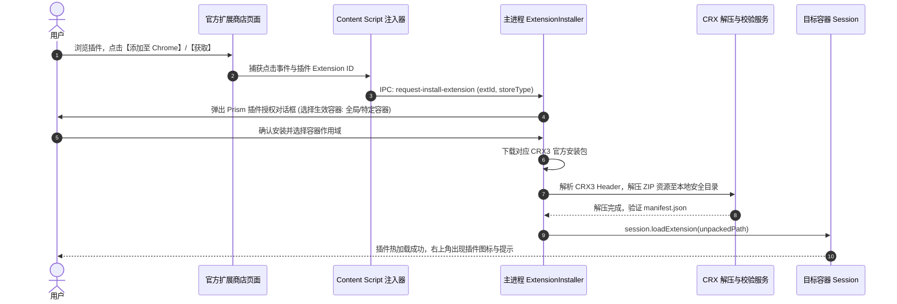

# 棱界 (Prism) — 核心功能需求与技术设计文档 (PRD & Functional Spec)

> **版本**：v1.0.0  
> **状态**：Draft / 规划中  
> **代号**：Prism (棱界)  
> **核心标语**：一束光，多重身份。一个浏览器，多个并行的“我”。

---

## 目录
1. [产品概述与设计哲学](#1-产品概述与设计哲学)
2. [总体系统架构设计](#2-总体系统架构设计)
3. [多容器物理隔离体系](#3-多容器物理隔离体系)
4. [标签视窗与容器交互系统](#4-标签视窗与容器交互系统)
5. [官方扩展商店一键安装引擎](#5-官方扩展商店一键安装引擎)
6. [插件容器级作用域与隔离系统](#6-插件容器级作用域与隔离系统)
7. [1Password 跨容器密码协同中继](#7-1password-跨容器密码协同中继)
8. [智能路由规则引擎与网络代理](#8-智能路由规则引擎与网络代理)
9. [安全防护、防关联与数据管理](#9-安全防护防关联与数据管理)
10. [研发里程碑与演进规划](#10-研发里程碑与演进规划)

---

## 1. 产品概述与设计哲学

### 1.1 背景与痛点
在当今互联网生态中，单个人通常拥有多重数字身份（工作主账号、工作测试账号、个人日常账号、开源贡献身份、海外社媒账号等）。现有的多账号使用方案存在严重割裂：
- **方案 A（隐身模式）**：每次关闭窗口丢失登录态，无法持久保存工作进度。
- **方案 B（多开不同浏览器）**：Chrome、Edge、Safari、Firefox 齐开，系统资源（CPU/内存）成倍开销，且快捷键和界面风格不统一。
- **方案 C（Chrome 多 Profile）**：每个 Profile 都是一个完整的独立操作系统窗口，多窗口在任务栏与桌面堆叠混乱；并且插件需在每个 Profile 中重新下载、重新登录授权，无法灵活共享。

### 1.2 棱界 (Prism) 的定义
**Prism (棱界)** 像三棱镜折射单束白光为七彩光谱一样，将用户的单一物理工作台折射为多个平行的数字身份容器。
- **物理隔离**：基于底层 Chromium Session Partitioning，在进程/存储层面切分存储树。
- **统一视窗**：单主窗口标签化管理所有容器，通过直观的色彩带与标识标记不同身份。
- **无缝插件**：直接访问 Chrome/Edge 扩展商店点击即装，既能让 1Password、uBlock 全局通行，又能将专属插件限制在特定容器。

---

## 2. 总体系统架构设计

Prism 基于 **Electron 33+ 与 Vite** 构建，采用分层物理隔离模型：

```mermaid
graph TD
    subgraph UI_Layer [渲染层 Browser Shell (React 18 + Tailwind)]
        TabBar[色彩感知标签栏]
        NavBar[智能地址导航栏]
        Sidebar[容器侧边切换栏]
        ExtPanel[插件管理抽屉]
    end

    subgraph Core_Dispatch [主进程调度核心 (Electron Main)]
        TabMgr[TabManager 标签调度器]
        ContainerMgr[ContainerManager 容器引擎]
        ExtensionMgr[ExtensionManager 插件生命周期]
        RuleEngine[SiteRuleEngine 域名路由]
        NativeBridge[1Password Native Messaging 中继]
    end

    subgraph Storage_Partitions [底层物理隔离会话 (Chromium Sessions)]
        SessDefault[Session: Default]
        SessWork["Session: persist:container_work (工作)"]
        SessPersonal["Session: persist:container_personal (个人)"]
        SessCustom["Session: persist:container_client (客户/测试)"]
    end

    UI_Layer -->|IPC 通信| Core_Dispatch
    TabMgr -->|挂载 WebContentsView| Storage_Partitions
    ExtensionMgr -->|loadExtension| Storage_Partitions
    NativeBridge <-->|跨 Session 中继| Storage_Partitions
```

---

## 3. 多容器物理隔离体系

### 3.1 容器物理模型 (Container Model)
每个容器代表一个独立的数字身份环境，数据结构定义如下：
```typescript
export interface ContainerDefinition {
  id: string;              // 容器唯一 ID (如: "work", "personal", "crypto")
  name: string;            // 容器展示名称 (如: "工作主舱", "私人空间")
  color: string;           // 容器主题色 HEX (如: "#3B82F6", "#10B981")
  icon: string;            // 容器图标 (Lucide Icon 标识符)
  partition: string;       // Chromium 分区标识: `persist:prism_${id}`
  isPrivate: boolean;      // 是否为阅后即焚临时容器 (内存分区)
  proxyConfig?: ProxyRule; // 容器专属独立网络代理 (HTTP / SOCKS5)
  userAgent?: string;      // 容器独立自定义 UA
  createdAt: number;
}
```

### 3.2 物理隔离技术规范
1. **存储完全独立**：
   - 使用 `session.fromPartition('persist:prism_' + id, { cache: true })` 创建独立 Session。
   - 每个容器独立维护私有的 **Cookies、IndexedDB、LocalStorage、SessionStorage、CacheStorage、Service Workers、WebSQL**。
   - 绝不允许不同容器共享未分区的本地存储。
2. **同站多账号无干扰验证**：
   - 容器 A（工作）登录 Google Workspace 账号 `work@company.com`。
   - 容器 B（个人）登录个人 Gmail 账号 `personal@gmail.com`。
   - 两个页面在同一个 Prism 窗口的不同标签中并行渲染，互不退登，互不串号。
3. **临时容器（阅后即焚）**：
   - 支持创建内存容器（非 `persist:` 前缀），窗口或容器关闭时所有 Cookie 和会话数据随内存释放直接销毁。
4. **一键清洗 (Sanitize)**：
   - 单击容器设置中的“清理容器数据”，调用 `session.clearStorageData()`，仅清空该容器下的数据，其他容器毫发无损。

---

## 4. 标签视窗与容器交互系统

### 4.1 现代 WebContentsView 多视图架构
摒弃过时的 `<webview>` 标签以及已废弃的 `BrowserView`，采用 Electron 现代标准：
- 主窗口使用 `BaseWindow` 承载外壳 UI（标签栏、地址栏、状态栏）。
- 每个网页标签页映射为一个底层的 `WebContentsView`。
- 标签切换即 `BaseWindow.contentView.addChildView(targetView)` 与 `removeChildView`，实现毫秒级硬件加速切换，无重渲染闪烁。

### 4.2 视觉色彩感知与标识体系
- **彩虹光谱标签栏**：每个标签页上方或底边具有与其所属容器完全一致的高亮色带。
- **沉浸式地址栏标识**：地址栏左侧常驻显示当前容器徽章（图标 + 容器名 + 色彩胶囊），使用户在浏览时对当前身份一目了然。
- **快速跨容器转移**：
  - 右键任意标签可选择：“移入其他容器打开”；
  - 地址栏快捷菜单支持一键克隆当前 URL 到指定容器。

---

## 5. 官方扩展商店一键安装引擎

### 5.1 痛点突破
在 Electron 中使用第三方 Chrome 插件通常需要开发者手动下载 CRX、解包并配置路径。Prism 打造全自动的**官方扩展商店无缝安装引擎**。

### 5.2 支持的官方商店渠道
1. **Chrome 网上应用店** (`https://chromewebstore.google.com/`)
2. **Microsoft Edge 加载项** (`https://microsoftedge.microsoft.com/addons/`)

### 5.3 一键安装核心技术链路



### 5.4 CRX3 自动化解析与下载规范
- **下载端点**：
  ```http
  https://clients2.google.com/service/update2/crx?response=redirect&os=win&arch=x64&os_arch=x86_64&nacl_arch=x86-64&prod=chromecrx&prodchannel=unknown&prodversion=130.0.0.0&acceptformat=crx2,crx3&x=id%3D{EXTENSION_ID}%26uc
  ```
- **解包处理**：
  - 读取 CRX3 二进制头部（Magic Number `Cr24`，版本 3，跳过 Header Length 字节）；
  - 将剩余 Payload 视作标准 ZIP 格式，使用 `adm-zip` 解压至 `<appData>/Prism/extensions/{extId}/{version}/`；
  - 自动读取并规范化 `manifest.json`。

---

## 6. 插件容器级作用域与隔离系统

### 6.1 插件作用域模式 (Extension Scoping)
Prism 支持将扩展精确指派到指定容器：

| 作用域模式 | 典型应用插件 | 行为机制 |
| :--- | :--- | :--- |
| **全局作用域 (Global)** | 1Password, uBlock Origin, Dark Reader | 所有已存在及新创建的容器 Session 均自动载入该插件 |
| **单容器绑定 (Container Scoped)** | GitHub PR 增强 (仅工作)、Twitter 小助手 (仅社交) | 仅在被勾选的指定容器 Session 中载入，其他容器环境保持纯净 |
| **开发者容器专属** | React Developer Tools, Redux DevTools | 仅在“开发测试”容器激活，避免影响其他容器正常浏览性能 |

### 6.2 扩展生命周期管理
- **热装载 (Hot-Loading)**：安装插件无需重启浏览器，主进程即刻在目标 Session 调用 `loadExtension`。
- **动态启停**：用户可在 Prism 插件中心随时启用/禁用某个插件，或动态增删其生效的容器。
- **存储隔离机制**：虽然插件代码统一解压在一处，但在不同容器 Session 中，插件所持有的 `chrome.storage.local` 与 Background 页面彼此隔离，确保插件配置亦不互相污染。

---

## 7. 1Password 跨容器密码协同中继

### 7.1 核心痛点与挑战
1Password 等现代密码管理器的 Chrome 扩展依赖与操作系统桌面客户端（1Password for Mac / Windows）通过 **Native Messaging** 通信，以实现指纹解锁、主密码解锁及受保护凭据的交换。
在多 Session 隔离架构下，若原生通信未作中继，不同容器将出现：
- 每个容器频繁弹出 1Password 解锁请求；
- Native Messaging 管道冲突甚至通讯失败。

### 7.2 Prism 跨容器中继架构 (Cross-Container Relay)

```mermaid
graph LR
    subgraph Prism_Browser [Prism 浏览器进程空间]
        subgraph Container_Work [工作容器 Session]
            ExtWork[1Password 扩展实例 A]
        end
        subgraph Container_Personal [个人容器 Session]
            ExtPersonal[1Password 扩展实例 B]
        end
        RelayCore[Prism Native Messaging 中继核心]
    end

    OS_1Password[1Password 桌面系统客户端 (Native Host)]

    ExtWork <-->|Virtual IPC| RelayCore
    ExtPersonal <-->|Virtual IPC| RelayCore
    RelayCore <-->|标准 stdio 管道| OS_1Password
```

### 7.3 体验实现标准
1. **单点解锁，全局感知**：
   - 用户在任意容器中通过 1Password 扩展解锁一次（或完成系统指纹/Windows Hello 认证）；
   - 中继核心保持长连接，其余所有容器内的 1Password 扩展自动同步为“已解锁状态”。
2. **多账号凭据智能感知**：
   - 当在“工作容器”打开 `github.com` 时，1Password 自动展示工作相关的登录项；
   - 当在“个人容器”打开 `github.com` 时，1Password 展示个人私有账号凭据；
   - 自动填充至对应容器的网页 DOM 中，Cookie 留在该容器内，彻底解决多账号登录的密钥选择痛点。

---

## 8. 智能路由规则引擎与网络代理

### 8.1 智能域名路由 (Site Rules Engine)
支持配置域名与容器的强绑定规则：
- **规则示例**：
  - `*.corp.google.com` ➔ 始终强制在 **[工作容器]** 打开；
  - `*.twitter.com`, `*.x.com` ➔ 始终强制在 **[社交媒体]** 打开；
  - `github.com/rfooox/*` ➔ 在 **[个人容器]** 打开。
- **拦截重定向流程**：
  - 监听 `session.webRequest.onBeforeRequest` 或导航跳转事件；
  - 若在不匹配的容器中点击了受规则保护的链接，Prism 弹出温和提示或自动新建目标容器的标签页，阻止错误身份访问。

### 8.2 容器级独立代理 (Container-Level Proxy)
- 每个容器可配置专属网络出口：
  - 容器 A（香港节点 SOCKS5）
  - 容器 B（美国节点 HTTP + 用户名密码认证）
  - 容器 C（直接直连 Direct）
- 底层通过 `session.setProxy()` 和 `session.webRequest.onAuthRequired` 独立注入，实现物理 IP 与身份的深度绑定。

---

## 9. 安全防护、防关联与数据管理

### 9.1 防关联与指纹噪声 (Anti-Fingerprinting)
- **Canvas / AudioContext 噪声微调**：可选在指定容器中注入细微数学噪声，防止第三方追踪服务通过硬件指纹串联多个容器。
- **WebRTC 泄露防护**：通过 `session.setSpellCheckerEnabled` 及 WebRTC 策略配置，禁止私有 IP 经由 WebRTC 穿透暴露。

### 9.2 敏感数据安全存储
- 容器的代理凭据、用户自定义规则通过 Electron 原生 `safeStorage`（Windows DPAPI / macOS Keychain）加密落盘，杜绝明文泄露。

---

## 10. 研发里程碑与演进规划

### 阶段一：核心基石与多容器会话隔离（M1）
- [ ] 基于 Electron + Vite 搭建现代化工程架构与 TypeScript 规范
- [ ] 实现 `ContainerManager`：支持创建、持久化、色彩标记多容器
- [ ] 实现 `TabManager`：基于 `WebContentsView` 实现色彩感知标签栏与平滑切换
- [ ] 验证同站（如 GitHub / Google）多容器并发独立登录与 Cookie 物理隔离

### 阶段二：官方扩展商店一键安装与作用域引擎（M2）
- [ ] 官方 Chrome Web Store / Edge Add-ons 一键安装脚本注入与 CRX3 自动解包服务
- [ ] 实现插件作用域控制面板（全局插件与指定容器插件动态绑定）
- [ ] 支持插件热挂载、卸载与状态管理

### 阶段三：1Password 跨容器密码协同与深度体验（M3）
- [ ] 实现 Native Messaging 跨 Session 通信中继核心
- [ ] 跑通 1Password 官方扩展一键解锁与各容器表单自动填充
- [ ] 标签页跨容器转移与克隆功能

### 阶段四：智能规则引擎与环境隔离增强（M4）
- [ ] 实现 URL 智能匹配与自动分流路由（Site Rules Engine）
- [ ] 容器专属 Proxy（HTTP / SOCKS5）独立设置与认证
- [ ] 容器数据一键清洗与隐私模式（阅后即焚容器）

### 阶段五：性能优化与发布交付（M5）
- [ ] 视图惰性休眠与后台容器内存优化策略
- [ ] Windows / macOS 安装包打包（electron-builder）与跨平台适配
